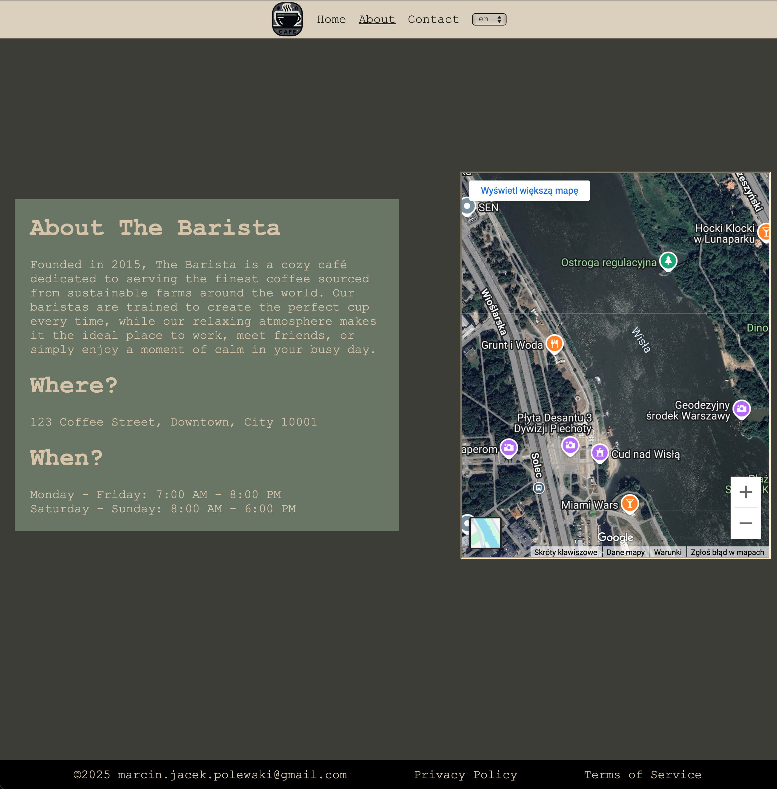
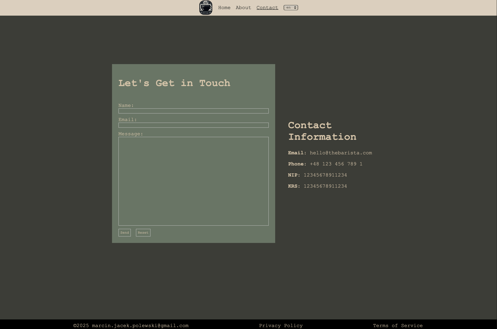

# About
Three page website created to practise React Router, i18n and GitHub Actions

Repository has a pipeline for auto deployment via GitHub pages

# Result Photos

## Main Page

## Information Page

## Contact Form

# Used Resourecs

## Actions used in CI
- https://github.com/actions/deploy-pages
- https://github.com/actions/upload-pages-artifact
- https://vite.dev/guide/static-deploy

## colours:
- https://colorhunt.co/palette/1e201e3c3d37697565ecdfcc

## Images:
- https://pixabay.com/photos/caffeine-coffee-cup-drink-espresso-1846280/
- https://pixabay.com/photos/cup-coffee-table-drinks-beverage-6878196/
- logo - ai generated
- https://pixabay.com/photos/coffeehouse-bar-shop-cafe-espresso-2600877/
- https://pixabay.com/photos/wooden-table-coffeehouse-shop-2594768/
- https://pixabay.com/photos/garden-outdoor-cafe-cafe-7111101/
- https://pixabay.com/photos/coffee-cafe-to-drink-brown-hot-5082544/